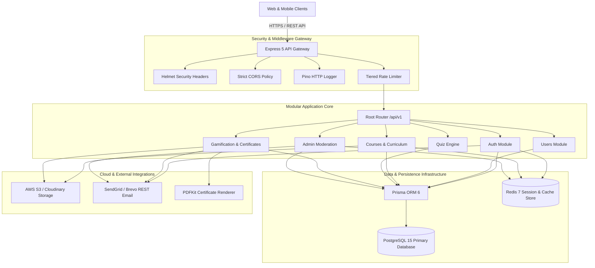
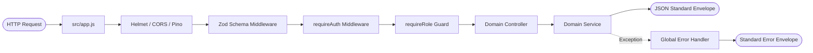
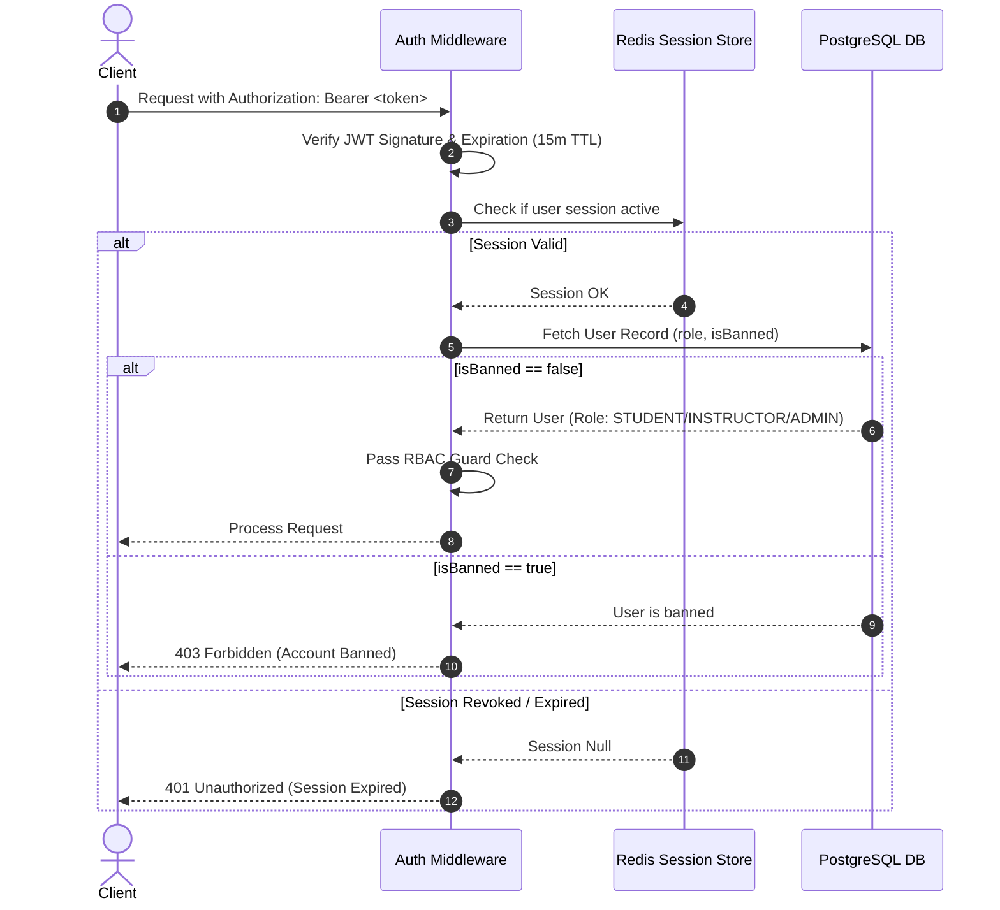

# EduSphere Backend Architectural Specification

| Field | Specification |
| :--- | :--- |
| **System Name** | EduSphere E-Learning & Assessment Backend |
| **Architecture Pattern** | Modular Layered Architecture (Controller-Service-Repository/ORM) |
| **Primary Stack** | Node.js 22 LTS (ES Modules), Express 5, PostgreSQL 15, Prisma ORM 6, Redis 7 |
| **Storage & Delivery** | AWS S3 / Cloudinary (Media & PDF Assets), SendGrid / Brevo REST API (Emails) |
| **Document Engine** | `pdfkit` (Automated Certificate Generation) |
| **API Protocol** | RESTful JSON API with OpenAPI 3.0 (Swagger UI at `/api-docs`) |
| **Alignment** | 100% Synchronized with [EduTRD.md](file:///c:/Users/DELL/Desktop/myfol/software_devops_ibm/08_Docker_Kubernetes/lab/02_IntroKubernetes/EduTRD.md), [apidoc.md](file:///c:/Users/DELL/Desktop/myfol/software_devops_ibm/08_Docker_Kubernetes/lab/02_IntroKubernetes/apidoc.md), and [erd.dbml](file:///c:/Users/DELL/Desktop/myfol/software_devops_ibm/08_Docker_Kubernetes/lab/02_IntroKubernetes/erd.dbml) |

---

## Table of Contents

- [1. High-Level System Architecture](#1-high-level-system-architecture)
- [2. Request Lifecycle & Middleware Pipeline](#2-request-lifecycle--middleware-pipeline)
- [3. Modular Directory Architecture](#3-modular-directory-architecture)
- [4. Module Inventory & Domain Boundaries](#4-module-inventory--domain-boundaries)
- [5. Data Persistence & Distributed Caching Layer](#5-data-persistence--distributed-caching-layer)
- [6. Authentication, Security & RBAC Engine](#6-authentication-security--rbac-engine)
- [7. Core Operational Workflows](#7-core-operational-workflows)
  - [7.1 Learning & Atomic Progress Engine](#71-learning--atomic-progress-engine)
  - [7.2 Server-Side Quiz Assessment Engine](#72-server-side-quiz-assessment-engine)
  - [7.3 Instructor Authoring & Self-Publishing Engine](#73-instructor-authoring--self-publishing-engine)
  - [7.4 Pre-Signed Media & Direct Asset Upload Workflow](#74-pre-signed-media--direct-asset-upload-workflow)
  - [7.5 Admin Moderation & Takedown Engine](#75-admin-moderation--takedown-engine)
  - [7.6 User Session Revocation & Ban Engine](#76-user-session-revocation--ban-engine)
- [8. Asset Management & Storage Strategy](#8-asset-management--storage-strategy)
- [9. Transactional Email & Notification Subsystem](#9-transactional-email--notification-subsystem)
- [10. Security & Hardening Architecture](#10-security--hardening-architecture)
- [11. Observability, Logging & Graceful Shutdown](#11-observability-logging--graceful-shutdown)
- [12. Testing Architecture & Execution Matrix](#12-testing-architecture--execution-matrix)
- [13. Deployment Pipeline & Containerization](#13-deployment-pipeline--containerization)

---

## 1. High-Level System Architecture

EduSphere utilizes a **Modular Layered Architecture** with strict boundary separation between HTTP transport, business domain logic, data persistence, distributed caching, and cloud storage providers.



---

## 2. Request Lifecycle & Middleware Pipeline

Every HTTP request traverses a deterministic middleware pipeline before reaching the target domain controller:



### Execution Steps
1. **Entry Point (`src/app.js`):** Attaches security headers (`helmet`), restricts origin access (`cors`), applies IP-based rate limiting, initiates structured HTTP logging (`pino-http`), and parses JSON bodies (`express.json()`).
2. **Routing Dispatch (`src/routes/v1.js`):** Routes requests to domain sub-routers (`/auth`, `/users`, `/courses`, etc.). Nested routes use `mergeParams: true` to pass parent route parameters down seamlessly.
3. **Middleware Pipeline:**
   * **`validate(schema)`:** Validates `req.body`, `req.params`, and `req.query` using Zod schemas. Invalid payloads return HTTP `422 Unprocessable Entity` instantly without hitting database code.
   * **`requireAuth`:** Extracts Bearer JWT token from `Authorization` header, verifies validity, checks Redis ban status, and attaches `req.user`.
   * **`requireRole([...roles])`:** Verifies that `req.user.role` matches target database role constraints (`STUDENT`, `INSTRUCTOR`, `ADMIN`).
4. **Domain Controller:** Parses input parameters and delegates business logic processing to the service layer.
5. **Service Layer:** Executes domain rules, manages relational database operations via Prisma `$transaction`, updates Redis caches, and returns data.
6. **Unified Error Handling:** Unhandled operational errors bubble up to the centralized error middleware in `src/app.js`, mapping custom `AppError` subclasses to standard JSON error responses.

---

## 3. Modular Directory Architecture

Each functional domain resides within its own self-contained directory under `src/modules/<module>/` following a uniform file naming convention:

```text
src/modules/<module>/
├── <module>.controller.js   # HTTP layer: parses req inputs, invokes service, formats envelope
├── <module>.service.js      # Business domain logic: Prisma queries, Redis calls, rules engine
├── <module>.routes.js       # Express router definitions, middleware binding, Swagger JSDoc
└── <module>.schema.js       # Zod validation schemas for body, params, and query strings
```

> [!IMPORTANT]
> **Strict Architectural Rules:**
> * **Controllers** MUST NOT execute Prisma queries or Redis commands directly. They only unpack HTTP requests and return standard API envelopes.
> * **Services** MUST NOT access Express `req` or `res` objects. They receive pure JS data objects and throw domain-specific `AppError` exceptions.
> * **Schemas** MUST strictly validate types and constraints using Zod before any controller logic executes.

---

## 4. Module Inventory & Domain Boundaries

The application is decomposed into **16 distinct modules**:

| Module Name | Domain Responsibilities | Primary Dependencies |
| :--- | :--- | :--- |
| **`auth`** | User registration, authentication, token refresh rotation, password recovery, email verification. | Prisma, Redis, `bcryptjs`, `jsonwebtoken` |
| **`users`** | Student/Instructor user profile management, avatar uploads, student dashboard metrics. | Prisma, Storage Integration |
| **`instructors`** | Public teaching portfolio, student enrollment counters, instructor dashboard analytics. | Prisma, Redis |
| **`subjects`** | Subject category taxonomy (`Technology`, `Business`), icon/color attributes, course counts. | Prisma, Redis |
| **`courses`** | Course catalog CRUD, multi-parameter search/filtering, publishing lifecycle, review summaries. | Prisma, Redis Cache |
| **`modules`** | Curriculum module hierarchy and sequence ordering (`orderIndex`). | Prisma |
| **`lessons`** | Lesson content rendering (video links, markdown content, code snippets), navigation helpers. | Prisma |
| **`enrollments`** | Student course enrollments, progress tracking, completion status updates. | Prisma, Progress Engine |
| **`quizzes`** | Quiz authoring, question management, server-side grading engine, attempt history. | Prisma, Quiz Engine |
| **`resources`** | Downloadable resource attachments, direct S3 upload pre-signed URL generation. | Prisma, AWS S3 / Cloudinary |
| **`bookmarks`** | Course and lesson favoriting and bookmark management. | Prisma |
| **`reviews`** | Course star ratings (1–5), student testimonials, aggregate rating calculation. | Prisma |
| **`achievements`** | Gamification engine, learning streak counter, automated badge unlocking. | Prisma |
| **`certificates`** | Automated PDF generation (`pdfkit`), certificate verification engine, PDF streaming. | Prisma, `pdfkit` |
| **`notifications`** | In-app user notifications, unread counters, transactional email dispatch. | Prisma, Email Integration |
| **`admin`** | Content moderation, course unpublishing, user role management, account bans, audit logs. | Prisma, Redis Session Revoker |

---

## 5. Data Persistence & Distributed Caching Layer

### 5.1 Primary Database (PostgreSQL 15 + Prisma 6)
* **Schema Definition:** Configured via `src/database/schema.prisma` mapping 20 relational entities.
* **Column Naming:** Database uses `snake_case` column names (`@map`), mapped to `camelCase` model attributes in JavaScript.
* **Primary Keys:** UUIDv4 generated using database `gen_random_uuid()`.
* **Soft Deletes:** Implemented via nullable `deletedAt` timestamps on `User` and `Course` models.

### 5.2 Distributed Cache & Session Management (Redis 7)
Redis (`ioredis`) is used for performance optimization and state management:

```
┌────────────────────────────────────────────────────────────────────────┐
│                              REDIS STORE                               │
├───────────────────┬──────────────────────────────┬─────────────────────┤
│   SESSION KEYS    │        CACHE KEYS            │     TOKEN KEYS      │
│ session:<userId>:*│ catalog:courses:page=1       │ pwd_reset:<token>   │
│ (Refresh Tokens)  │ catalog:featured             │ verify_email:<token>│
└───────────────────┴──────────────────────────────┴─────────────────────┤
```

* **Session Management:** Stores active refresh token hashes.
* **Instant Revocation:** When an account is banned or logged out, all `session:<userId>:*` keys are deleted from Redis instantly.
* **Catalog Caching:** Caches high-frequency public catalog queries (`catalog:courses:*`). Invalidates automatically when an instructor updates or publishes a course.

---

## 6. Authentication, Security & RBAC Engine



### Dual-Token Security Standard
1. **Access Tokens:** Short-lived JWTs (**15-minute TTL**) containing `userId`, `email`, and `role`, passed in the HTTP `Authorization: Bearer <token>` header.
2. **Refresh Tokens:** Long-lived JWTs (**7-day TTL**) stored in `HttpOnly`, `SameSite=Strict`, `Secure` cookies.
3. **Refresh Rotation:** Every refresh invocation invalidates the prior refresh token in Redis and issues a fresh token pair.

---

## 7. Core Operational Workflows

### 7.1 Learning & Atomic Progress Engine
```
[Student Marks Lesson Complete / Passes Quiz]
                     │
                     ▼
       POST /api/v1/lessons/:id/complete
                     │
                     ├─► 1. Verify Active Enrollment (status == ACTIVE)
                     ├─► 2. Upsert LessonProgress (isCompleted = true)
                     ├─► 3. Atomic Transactional Recalculation:
                     │      completedCount = COUNT(completed lessons)
                     │      totalLessons = COUNT(course lessons)
                     │      newProgress = ROUND((completed / total) * 100, 2)
                     ├─► 4. Update Enrollment progressPercent
                     └─► 5. IF newProgress == 100.0%:
                            ├── Set Enrollment status = COMPLETED
                            ├── Issue Certificate Record (EDU-YYYY-XXXXX)
                            ├── Render PDF via PDFKit -> S3 Bucket
                            ├── Unlock Achievements & Streaks
                            └── Dispatch Completion Email & Notification
```

### 7.2 Server-Side Quiz Assessment Engine
* **Answer Key Isolation:** `GET /quizzes/:id` returns questions and options but **strips `correctAnswerIndex`** to prevent browser inspection cheating.
* **Server Evaluation:** `POST /quizzes/:id/submit` compares submitted answers against PostgreSQL in server memory, calculates score `%`, and records `QuizAttempt`.
* **Automatic Progress:** If score `% >= passingScore`, the linked lesson is automatically marked complete via the Progress Engine.

### 7.3 Instructor Authoring & Self-Publishing Engine
* Instructors draft courses privately (`isPublished = false`).
* Clicking **Publish** triggers an atomic validation check: course must have `totalModules >= 1` and `totalLessons >= 1`.
* Successful publishing automatically invalidates public course catalog caches in Redis (`DEL catalog:courses:*`).

### 7.4 Pre-Signed Media & Direct Asset Upload Workflow
To prevent large video uploads (e.g., 500MB 4K files) from swamping API memory:
1. Client requests upload URL: `POST /api/v1/resources/upload-url`.
2. Server generates a 15-minute pre-signed AWS S3 / Cloudinary `PUT` URL.
3. Client uploads file **directly from browser to cloud storage bucket**.
4. Client confirms upload: `POST /api/v1/resources/confirm` to persist metadata in PostgreSQL.

### 7.5 Admin Moderation & Takedown Engine
* Admins can unpublish violating courses (`PATCH /admin/courses/:id/unpublish`) or soft-delete them (`DELETE /admin/courses/:id`).
* Executes inside a transaction: updates course status, clears Redis catalog cache, sends an alert email to the instructor with the violation reason, and writes an immutable record to `AuditLog`.

### 7.6 User Session Revocation & Ban Engine
* Admins can ban accounts (`POST /admin/users/:id/ban`).
* System sets `isBanned = true` in PostgreSQL, immediately deletes all matching Redis session keys (`DEL session:<userId>:*`), and logs the admin action to `AuditLog`.
* Banned users are instantly blocked on their next API request even if their access token has not expired.

---

## 8. Asset Management & Storage Strategy

| Asset Type | Upload Workflow | Storage Location | Access Control |
| :--- | :--- | :--- | :--- |
| **Avatars** | Direct multipart upload via `Multer` (Max 2MB) | AWS S3 / Cloudinary | Public Read |
| **Course Videos** | Direct S3 Pre-Signed PUT URL (Max 500MB) | AWS S3 / Cloudinary | Enrolled Students Only |
| **Downloadable Resources** | Direct S3 Pre-Signed PUT URL (Max 10MB) | AWS S3 / Cloudinary | Enrolled Students Only |
| **PDF Certificates** | Server-side generation via `pdfkit` | AWS S3 / Direct Stream | Public Verification / Owner Download |

---

## 9. Transactional Email & Notification Subsystem

* Integrated with SendGrid / Brevo REST APIs via `axios` (HTTPS REST execution avoids blocked SMTP ports).
* **Templates:** HTML templates rendered for `Email Verification`, `Password Reset`, `Enrollment Confirmation`, and `Certificate Award`.
* **Resilience:** Email dispatch runs asynchronously after database transactions commit; email failures log an error record without rolling back user actions.

---

## 10. Security & Hardening Architecture

| Threat Vector | Mitigation Strategy |
| :--- | :--- |
| **XSS & Injection** | `helmet` HTTP headers, Content Security Policy, strict Zod schema sanitization. |
| **SQL Injection** | 100% Parameterized queries via Prisma ORM. |
| **Brute Force Attacks** | Tiered rate limiting via `express-rate-limit` (Auth endpoints capped at 5 req / 15 min). |
| **Quiz Cheating** | Complete server-side isolation of `correctAnswerIndex`. |
| **Unauthorized Access** | Dual-token JWT + Redis active session verification + Granular RBAC guards. |
| **Mass Data Leakage** | Production error envelopes mask stack traces and raw database error codes. |

---

## 11. Observability, Logging & Graceful Shutdown

* **Structured Logging:** `pino` JSON logger formatted for ingestion by log aggregation tools (Datadog, Grafana Loki).
* **Health Probes:** `GET /health` executes live database ping (`SELECT 1`) and Redis `PING`, returning `200 Healthy` or `503 Service Unavailable`.
* **Graceful Shutdown:** Intercepts `SIGTERM` and `SIGINT`, halts HTTP listener, drains active connections, closes Redis client, and disconnects Prisma ORM cleanly with a 10-second safety timeout.

---

## 12. Testing Architecture & Execution Matrix

Tested across unit, integration, and performance levels using **Vitest 4** and **Supertest 7**:

```bash
# Execute unit tests (isolated domain logic & formula calculations)
npm run test:unit

# Execute API integration tests (HTTP requests against test database)
npm run test:integration

# Generate code coverage report (Enforced target: >85%)
npm run test:coverage

# Execute code formatting & linting validation
npm run lint
```

---

## 13. Deployment Pipeline & Containerization

### Multi-Stage Docker Build
```dockerfile
# Stage 1: Build & Prisma Generation
FROM node:22-alpine AS builder
WORKDIR /app
COPY package*.json ./
RUN npm ci
COPY prisma ./prisma/
RUN npx prisma generate
COPY . .
RUN npm run build --if-present

# Stage 2: Production Runner
FROM node:22-alpine AS runner
WORKDIR /app
ENV NODE_ENV=production
RUN addgroup -S nodejs && adduser -S nodeapp -G nodejs
COPY --from=builder /app/node_modules ./node_modules
COPY --from=builder /app/package*.json ./
COPY --from=builder /app/prisma ./prisma
COPY --from=builder /app/src ./src
USER nodeapp
EXPOSE 5000
HEALTHCHECK --interval=30s --timeout=5s --start-period=10s --retries=3 \
  CMD wget --no-verbose --tries=1 --spider http://localhost:5000/health || exit 1
CMD ["node", "src/server.js"]
```

### Local Multi-Container Orchestration (`docker-compose.yml`)
* **`api`:** Node.js 22 Express Server (Port 5000)
* **`postgres`:** PostgreSQL 15 Database (Port 5432)
* **`redis`:** Redis 7 Cache & Session Store (Port 6379)